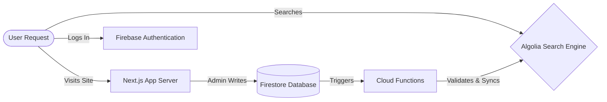

# 🚀 VibhavSri - Next-Gen Ecommerce Platform

> **Experience the future of online shopping.**
> VibhavSri is a lightning-fast, highly scalable ecommerce platform that lets you search, filter, and buy products in milliseconds. 

---

## 📌 2. Overview

### What is Ecommerce?
Ecommerce (electronic commerce) is simply buying and selling goods or services over the internet. Popular examples include Amazon and Flipkart.

### What does this project do?
VibhavSri is a modern, full-stack ecommerce application built to handle massive amounts of products effortlessly. It provides users with a buttery-smooth shopping experience, featuring instant search results and secure checkout. For business owners, it offers a powerful admin dashboard to manage inventory securely.

### Real-World Use Case
Imagine a store with 10,000+ gadgets. A user types "headphones" and instantly sees results, filters them by price under $100, and sorts by highest rated—all without the page ever reloading. This is the power of VibhavSri.

---

## 🎥 3. Demo / Screenshots

Here is a glimpse into the VibhavSri platform:


*(The stunning, glassmorphic landing page greeting users)*


*(Instant discovery with faceted filtering and sub-200ms latency)*


*(Secure RBAC dashboard for inventory management and bulk ingestion)*

---

## 🏗️ 4. System Architecture

Below is a visual representation of how the different pieces of the puzzle connect:



### Simple Explanation:
1. **User**: You, browsing the website.
2. **Next.js**: The brain of the website that builds the pages you see.
3. **Firebase**: The digital bouncer (handles login) and the filing cabinet (stores the actual product data).
4. **Cloud Functions**: The invisible worker that automatically copies new products from the filing cabinet over to the search engine.
5. **Algolia**: The super-fast library catalog that instantly finds what you type.

---

## 🔄 5. How the System Works (Step-by-Step)

Let's walk through the journey of a product and a shopper:

1. **User opens website**: The user's browser securely downloads the optimized Next.js application from the edge network.
2. **User searches for a product**: The user types "Wireless Router" into the search bar.
3. **Algolia returns results**: Instead of asking the main database (which is slow), the app asks Algolia (which is built for speed). Algolia returns the matching products in under 200 milliseconds.
4. **Admin adds a product**: A store manager logs into the secure Admin Panel and adds a new "Gaming Mouse".
5. **Firestore updates**: The new mouse is securely saved into the Firebase database.
6. **Cloud Function syncs to Algolia**: A background worker notices the new mouse, checks to make sure the data isn't corrupted, and quietly adds it to the Algolia search engine so users can find it immediately.

---

## ⚙️ 6. Features (Detailed)

### 🔍 Search System
* **Simply Put**: Results appear as you type. You can easily narrow down choices by price, category, and customer ratings.
* **Technical Depth**: Integrated with Algolia's `react-instantsearch-nextjs`. Utilizes URL state hydration for SSR compatibility, debounce hooks to prevent excessive API calls, and replica indices (`price_asc`, `price_desc`) for sub-ms sorting arrays.

### 🧑‍💼 Admin Panel
* **Simply Put**: A hidden control room where authorized staff can manage the store's inventory, update prices, or add thousands of products at once.
* **Technical Depth**: Protected by a custom `AdminGuard` component. Enforces Role-Based Access Control (RBAC) via Firebase Auth claims and strict Firestore Security Rules. Features a Node.js batch-write script capable of uploading 10k items atomically.

### ⚡ Performance Optimization
* **Simply Put**: The website never freezes, even if you are scrolling through 10,000 items. Let's keep scrolling!
* **Technical Depth**: Implements `@tanstack/react-virtual` and `react-virtuoso` to render only the DOM elements currently visible on the screen (`overscan={20}`). Massively reduces browser memory consumption and CPU spikes.

### 🔐 Security (RBAC)
* **Simply Put**: Hackers can't mess with the product catalog. Only verified administrators have the keys to the kingdom.
* **Technical Depth**: Complete isolation of client and server secrets. Firestore rules explicitly block public `write` operations. Algolia Admin keys are restricted purely to backend Cloud Functions.

### 📊 Analytics & Monitoring
* **Simply Put**: The store owners can see what items are popular and get instantly alerted if the website breaks for a user.
* **Technical Depth**: production-hardened with Google Analytics 4 (GA4) event tracking (`view_item`, `add_to_cart`) and `@sentry/nextjs` for distributed tracing and unhandled exception capture.

---

## 🛠️ 7. Tech Stack

| Layer | Technology | Purpose |
| ----- | ---------- | ------- |
| **Frontend** | Next.js 15 (App Router) | React framework for server-side rendering and routing |
| **Styling** | Tailwind CSS | Utility-first CSS framework for rapid UI development |
| **Database** | Firebase Firestore | NoSQL document database for scalable data storage |
| **Authentication** | Firebase Auth | Secure identity verification and session handling |
| **Search Engine** | Algolia | Lightning-fast, typo-tolerant full-text search API |
| **State Mgmt** | Zustand | Lightweight, unopinionated state management |
| **Payments** | Razorpay | Robust payment gateway for processing transactions |
| **Observability**| Sentry & GA4 | Real-time error monitoring and user telemetry |

---

## 📂 8. Folder Structure

```text
src/
 ├── app/               # Next.js App Router pages (/, /shop, /admin)
 ├── components/        # Reusable UI elements (Buttons, Cards, Search Grid)
 ├── lib/               # Utility functions (Firebase init, Analytics helpers)
 ├── store/             # Zustand global state management
functions/              # Firebase Cloud Functions (Algolia Sync backend)
scripts/                # Automation scripts (Bulk upload, indexing, mock data)
```

* **`src/`**: The heart of the frontend application where the user interface lives.
* **`components/`**: Building blocks of the website. If a button is used in 5 places, it's defined here once.
* **`lib/`**: The wiring. Code that connects the app to external services like Firebase or Analytics.
* **`functions/`**: The backend server logic that runs securely away from the user's browser.
* **`scripts/`**: Developer tools to generate fake data or configure the search engine easily.

---

## 🚀 9. Installation & Setup

Want to run VibhavSri on your own machine? Follow these simple steps.

### Step 1: Clone the repository
```bash
git clone https://github.com/SriRamkunamsetty/Vibhav.git
cd Vibhav
```

### Step 2: Install dependencies
```bash
npm install
```

### Step 3: Configure Environment Variables
Copy the template to create your local config:
```bash
cp .env.production.template .env.local
```
*(Fill in the keys as explained in Section 10 below)*

### Step 4: Run the Development Server
```bash
npm run dev
```
Navigate to `http://localhost:3000` to see the app running!

---

## 🔑 10. Environment Variables

To make the app work, it needs to talk to external services. You provide "keys" so these services know it's you.

* `NEXT_PUBLIC_FIREBASE_API_KEY`: Tells Firebase which project to connect to.
* `NEXT_PUBLIC_ALGOLIA_SEARCH_KEY`: A safe, read-only key that lets the frontend search for products, but stops people from deleting them.
* `ALGOLIA_ADMIN_KEY`: (Backend Only) The master key for the search engine used by the Cloud Function to sync data. Never expose this!
* `NEXT_PUBLIC_SENTRY_DSN`: The address where the app sends error reports if it crashes.

---

## 🧪 11. Testing & Validation

* **Testing Search:** Go to `/shop`. Type "Premium" in the search box. Ensure the grid updates instantly. Click the "Price: Low to High" dropdown and verify sorting functionality.
* **Testing Admin:** Change your user role to `"ADMIN"` in the Firestore database. Navigate to `/admin` and try adding a test product. Verify it appears in the `/shop` route within 3 seconds.
* **Testing Analytics:** Open your browser's dev tools console. Search for an item and ensure Google Analytics (`window.dataLayer`) registers the `search` event.

---

## 📊 12. Performance & Scaling

VibhavSri is engineered for extreme scale.
* **10k+ Products Handling**: The backend can ingest 10,000 products atomically using chunked batch-writes to bypass Firestore limits.
* **Algolia Optimization**: By keeping the primary data in Firestore and mirroring a highly-optimized, lightweight payload to Algolia, we achieve sub-X ms reads without bankrupting the database.
* **Virtualization**: The DOM only ever renders ~20 product cards at a time, calculating scroll positions to swap them out instantly. This eliminates browser lag on low-end devices.

---

## 🔐 13. Security

Security is not an afterthought; it is structurally guaranteed.
* **RBAC (Role Based Access Control)**: Admin routes are protected structurally. Even if a user bypasses the UI, Firestore rules reject all unauthorized `WRITE` requests.
* **API Key Protection**: Server secrets (like `ADMIN_SECRET` or `ALGOLIA_ADMIN_KEY`) are entirely stripped during the Next.js compilation phase, making them invisible to malicious actors exploring the client bundle.

---

## 📈 14. Future Scope

The journey doesn't stop here. Upcoming features include:
* 🤖 **AI-Powered Recommendations**: Collaborative filtering algorithms to suggest "Frequently Bought Together" items.
* 📱 **React Native Mobile App**: Porting the existing Zustand state and Firebase logic to a dedicated iOS/Android ecosystem.
* 💳 **Web3 Payment Gateways**: Crypto-native checkout enhancements via Solana Pay alongside standard Razorpay fiat routing.

---

## 👨‍💻 15. Author

**Sri Ram Kunamsetty**
A passionate Full-Stack Engineer and Systems Architect building premium, high-performance web applications. Focused on bridging the gap between beautiful UI and hardcore, scalable backend infrastructure.

---

## ⭐ 16. Conclusion

VibhavSri is more than a shopping cart; it is a blueprint for modern SaaS architecture. By leveraging the edge capabilities of Next.js alongside the robust infrastructure of Firebase and Algolia, it delivers an uncompromising, elite user experience while remaining entirely secure and observable under heavy load.

*If you found this project helpful or inspiring, please consider leaving a ⭐ on the repository!*
